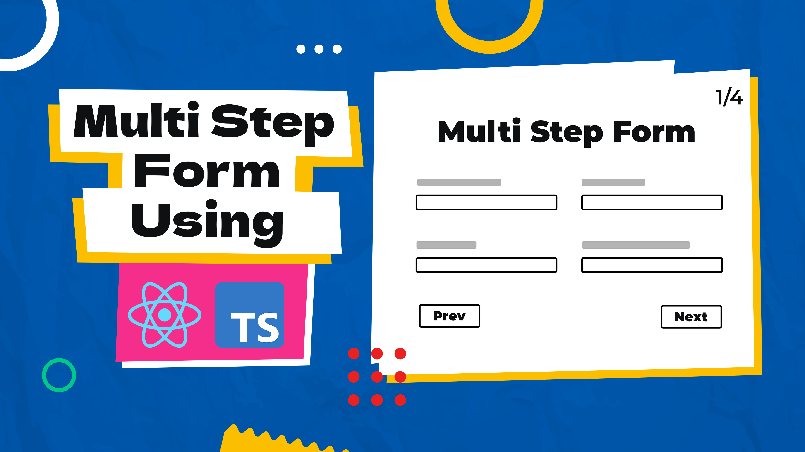

# How to Build a Multi Step Form with React and TypeScript with Custom Hook | Multistep Form

A multi-step form implemented with React and TypeScript, featuring a custom hook, offers a streamlined and organized approach to gathering user input. This form guides users through sequential steps, breaking down complex tasks into manageable sections. The integration of React ensures a modular and component-based structure, while TypeScript enhances code reliability. The custom hook facilitates efficient form state management, validation, and step navigation, promoting reusability and maintainability. This solution provides a user-friendly experience for tasks such as registrations or detailed data submissions, with dynamic rendering and intuitive step-by-step navigation.

Youtube Tutorial Link: https://youtu.be/AaZUrMKE1nk

